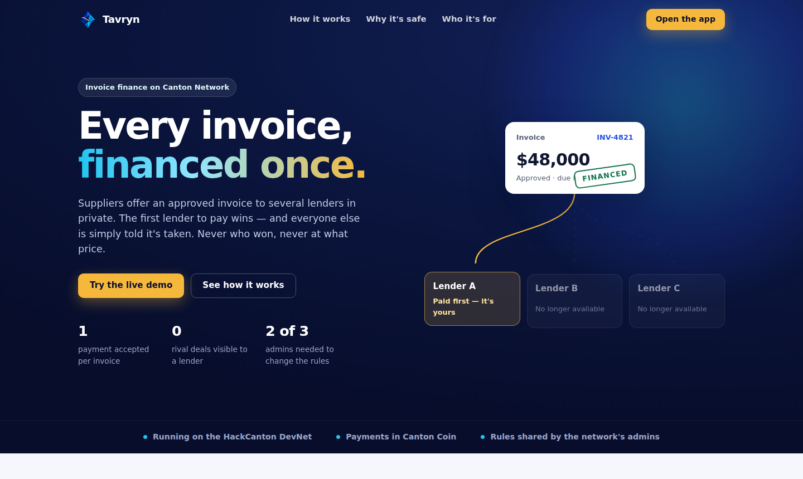

# Tavryn

**Every invoice can be financed once, and lenders never see each other's deals.**

**Live at [tavryn.site](https://tavryn.site)** · [open the app](https://tavryn.site/app)



## The problem

A supplier waiting 60 days to be paid can sell its invoice to a lender for cash today.
But each lender only sees its own deals, so the same invoice can be sold to two or three
lenders at once. The buyer pays once, and someone loses the money.

A shared register of invoices would stop this, but no lender will put its clients and
prices where competitors can see them.

This is not hypothetical. In September 2025 **First Brands** collapsed owing US$2.3bn to
invoice financiers, and its restructuring chief is investigating "whether the same
receivables may have been factored more than once"
([Global Trade Review](https://www.gtreview.com/news/americas/first-brands-faces-investigation-into-double-financing-of-receivables-inventory/)).
The same month, US prosecutors charged **Tricolor**'s executives over schemes to
"double-pledge collateral to multiple lenders"
([SDNY](https://www.justice.gov/usao-sdny/pr/ceo-cfo-coo-charged-connection-billion-dollar-collapse-tricolor-auto)).
Global factoring passed **€4 trillion** a year in 2025
([FCI](https://fci.nl/en/news/fci-releases-2025-world-industry-statistics-global-factoring-market-surpasses-eu4-trillion?language_content_entity=en)).

## What Tavryn does

1. **The supplier** creates an invoice. Only the supplier and the buyer can see it.
2. **The buyer** approves it, once. An invoice number can never be approved twice.
3. **The supplier** offers it privately to several lenders. Each lender sees only its own
   offer.
4. **The first lender to pay wins.** Every other lender is told *"This invoice is no
   longer available"*, and nothing about who won or at what price.
5. **The buyer** repays the winning lender on the due date.

## Why it can be trusted

- **One payment per invoice, guaranteed by the network itself.** It isn't a promise from a
  company running a database. When two lenders tried to pay for the same invoice at the
  same moment, the network accepted one and refused the other.
- **Private by design.** Each company sees only its own business. A lender that lost an
  invoice learns that it is gone, and nothing more.
- **Real money moves.** Lenders pay suppliers and buyers repay lenders in Canton Coin. If a
  payment is interrupted halfway, Tavryn finishes it automatically, and never pays twice.
- **No single owner.** The network's rules (which lenders can join, and how much of an
  invoice they may advance) are signed by all the organisations that run it. A change
  needs two of three of them to agree.

## See it working

**Measured, not claimed.** In 45 simultaneous payment races on two Canton networks (30 on
LocalNet, 15 on the HackCanton DevNet), exactly one lender won every time, and every
second lender was refused by the network itself. On LocalNet the losing lender is told in
0.75 s (median). Every duplicate approval was refused. Canton Coin funding and repayment
succeeded 5 of 5. Details and sources: [docs/VALIDATION.md](docs/VALIDATION.md).

- **Live on the HackCanton DevNet:** the full flow and the shared rules ran on the
  hackathon's network on 5 October 2026 ([record](docs/evidence/P7_DEVNET_2026-10-05.json)).
- **Canton Coin on the DevNet:** on 6 October 2026 a lender paid a supplier 80 CC from its
  own DevNet wallet through Tavryn, the receipt on the ledger carries the same payment
  reference, and the rival lender was refused ([record](docs/evidence/P3_SETTLEMENT_DEVNET_2026-10-06.json)).
  Canton Coin repayment is proven on LocalNet.
- **A recorded walkthrough of the app:** every step from invoice to repayment, plus a
  rule change refused with one approval and applied with two
  ([video and screenshots](docs/evidence/P5_CLICKTHROUGH_2026-10-06/)).
- **Demo script:** [docs/DEMO.md](docs/DEMO.md).

## The app

Each company (supplier, buyer, each lender, the auditor and the network admins) has its
own page and sees only its own business.


## Who it's for

Large buyers that run supplier-finance programmes, their suppliers, and the banks and funds
that finance those invoices. Lenders pay a fee per invoice financed, because they are the
ones protected from double financing. More in [the business brief](docs/BRIEF.md) and
[the pilot plan](docs/PILOT.md).

## Why Canton Network

Canton lets several companies share one fact (*"has this invoice been financed yet?"*)
without sharing anything else. Each company's data is visible only to the companies in
that deal. That is exactly what invoice finance needs, and an ordinary public blockchain
or a shared database can't offer it.

## Try it yourself

You need a Canton network to connect to (a local one, or the HackCanton DevNet), plus
Node.js and the Daml tools (`dpm`). Then:

```sh
dpm build && dpm test                       # build and test the contracts
cd backend && npm install && npm run build
cp ../.env.example .env                     # fill in your network's details
npm run bootstrap                           # set up the network once
npm start                                   # open http://127.0.0.1:<port>
```

Developer details (every setting, the automated checks and how it is built) are in
[backend/README.md](backend/README.md) and [docs/ARCHITECTURE.md](docs/ARCHITECTURE.md).

## Current limits

- Tavryn can only stop double financing among lenders on the network. A lender outside it
  can't be checked.
- A lender offered an invoice can see which other lenders were invited to bid on it, but
  never their offers or prices.
- In this demo one server acts for every company. In real use, each company would run its
  own connection to the network.
- Real customer interviews are still to come.

## Built with AI assistance

There was no pre-existing Tavryn code. AI tools helped write it; the team reviewed the work
and is responsible for the code and every claim here.
